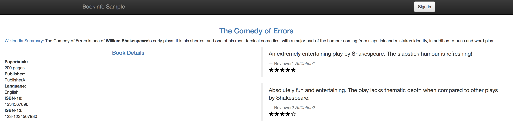
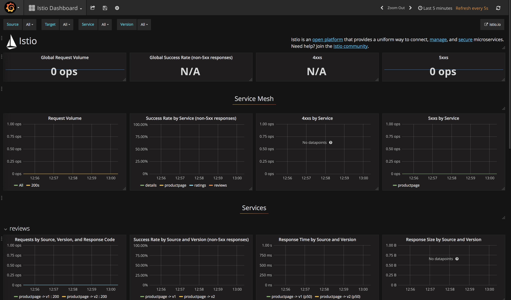

# Istio: Traffic Management for your Microservices

*Original repository [HERE](https://github.com/IBM/microservices-traffic-management-using-istio?cm_sp=IBMCode-_-manage-microservices-traffic-using-istio-_-Get-the-Code). This repo has been adapted for Compus Party Uruguay 2019*

# Prerequisite
Create a Kubernetes cluster in [IBM Cloud Kubernetes Service](https://console.ng.bluemix.net/docs/containers/cs_ov.html#cs_ov) to deploy in cloud.

Install kubernetes CLI tools and Kubernetes Service plug-in;

```bash
$ curl -sL https://ibm.biz/idt-installer | bash
```

On your machine, create a directory to clone this repo and to download Istio into:

```bash
$ mkdir istiorepo
$ cd istiorepo
$ git clone https://github.com/IBMInnovationLabUY/demo-istio.git
```

#PRESENTACIÓN

You will also need Istio service mesh installed on top of your Kubernetes cluster.
Here are the steps (Make sure to change the version to your downloaded one):

```bash
$ curl -L https://git.io/getLatestIstio | sh -
$ mv istio-<version> istio # replace with version downloaded
$ ibmcloud login -a https://api.ng.bluemix.net #If you have a federated ID, use ibmcloud login --sso to get started.
$ ibmcloud ks region-set <region> #us-south
$ ibmcloud ks cluster-config <cluster-name> #mycluster
$ kubectl get nodes #check connection established correctly
$ kubectl apply -f istio/install/kubernetes/istio-demo.yaml
```


# Steps

### Part A: Deploy sample Bookinfo application and inject Istio sidecars to enable traffic flow management, access policy and monitoring data aggregation for application

1. [Deploy sample BookInfo application with Istio sidecar injected](#1-deploy-sample-bookinfo-application-with-istio-sidecar-injected)
2. [Configure Traffic flow](#2-traffic-flow-management-using-istio-pilot---modify-service-routes)
3. [Configure access control](#3-access-policy-enforcement-using-istio-mixer---configure-access-control)
4. [Collect metrics, logs and trace spans](#4-telemetry-data-aggregation-using-istio-mixer---collect-metrics-logs-and-trace-spans)
     - 4.1 [Collect metrics and logs using Prometheus and Grafana](#41-collect-metrics-and-logs-using-prometheus-and-grafana)
     - 4.2 [Collect request traces using Jaeger](#42-collect-request-traces-using-jaeger)

## Part A: Deploy sample Bookinfo application and inject Istio sidecars to enable traffic flow management, access policy and monitoring data aggregation for application

## 1. Deploy sample BookInfo application with Istio sidecar injected

In this part, we will be using the sample BookInfo Application that comes as default with Istio code base. As mentioned above, the application that is composed of four microservices, written in different languages for each of its microservices namely Python, Java, Ruby, and Node.js. The default application doesn't use a database and all the microservices store their data in the local file system.
Envoys are deployed as sidecars on each microservice. Injecting Envoy into your microservice means that the Envoy sidecar would manage the ingoing and outgoing calls for the service. To inject an Envoy sidecar to an existing microservice configuration, do:

```bash
$ kubectl apply -f <(./istio/bin/istioctl kube-inject -f istio/samples/bookinfo/platform/kube/bookinfo.yaml)
```

> `istioctl kube-inject` modifies the yaml file passed in _-f_. This injects Envoy sidecar into your Kubernetes resource configuration. The only resources updated are Job, DaemonSet, ReplicaSet, and Deployment. Other resources in the YAML file configuration will be left unmodified.

After a few minutes, you should now have your Kubernetes Pods running and have an Envoy sidecar in each of them alongside the microservice. The microservices are **productpage, details, ratings, and reviews**. Note that you'll have three versions of the reviews microservice.
```
$ kubectl get pods

NAME                                        READY     STATUS    RESTARTS   AGE
details-v1-1520924117-48z17                 2/2       Running   0          6m
productpage-v1-560495357-jk1lz              2/2       Running   0          6m
ratings-v1-734492171-rnr5l                  2/2       Running   0          6m
reviews-v1-874083890-f0qf0                  2/2       Running   0          6m
reviews-v2-1343845940-b34q5                 2/2       Running   0          6m
reviews-v3-1813607990-8ch52                 2/2       Running   0          6m
```

Create an Istio ingress gateway to access your services over a public IP address.

```bash
kubectl apply -f  istio/samples/bookinfo/networking/bookinfo-gateway.yaml
```

To access your application, you can check the public IP address of your application with the following command.
Note the IP address will also be different for your cluster.

```bash
$ export GATEWAY_URL=$(ibmcloud ks workers <cluster-name> | grep normal | awk '{print $2}' | head -1):$(kubectl get svc istio-ingressgateway -n istio-system -o jsonpath={.spec.ports[0].nodePort}) #mycluster

$ echo 'Access your application via: http://'$GATEWAY_URL'/productpage' 
Access your application via: http://169.55.105.75:31380/productpage
```

If you refresh the page multiple times, you'll see that the _reviews_ section of the page changes. That's because there are 3 versions of **reviews**_(reviews-v1, reviews-v2, reviews-v3)_ deployment for our **reviews** service. Istio’s load-balancer is using a round-robin algorithm to iterate through the 3 instances of this service





## 2. Traffic flow management using Istio Pilot - Modify service routes

In this section, Istio will be configured to dynamically modify the network traffic between some of the components of our application. In this case we have 2 versions of the “reviews” component (v1 and v2) but we don’t want to replace review-v1 with review-v2 immediately. In most cases, when components are upgraded it’s useful to deploy the new version but only have a small subset of network traffic routed to it so that it can be tested before the old version is removed. This is often referred to as “canary testing”.

There are multiple ways in which we can control this routing. It can be based on which user or type of device that is accessing it, or a certain percentage of the traffic can be configured to flow to one version.

This step shows you how to configure where you want your service requests to go based on weights and HTTP Headers. You would need to be in the root directory of the Istio release you have downloaded on the Prerequisites section.

* Destination Rules

Before moving on, we have to define the destination rules. The destination rules tell Istio what versions (subsets in Istio terminology) are available for routing. This step is required before fine-grained traffic shaping is possible.

```bash
$  kubectl apply -f istio/samples/bookinfo/networking/destination-rule-all.yaml
destinationrule.networking.istio.io/productpage created
destinationrule.networking.istio.io/reviews created
destinationrule.networking.istio.io/ratings created
destinationrule.networking.istio.io/details created
```

For more details, see the [Istio documentation](https://istio.io/docs/tasks/traffic-management/traffic-shifting/).

* Set Default Routes to `reviews-v1` for all microservices  

This would set all incoming routes on the services (indicated in the line `destination: <service>`) to the deployment with a tag `version: v1`. To set the default routes, run:

  ```bash
  $ kubectl apply -f istio/samples/bookinfo/networking/virtual-service-all-v1.yaml 
  ```

* Set Route to `reviews-v2` of **reviews microservice** for a specific user  

This would set the route for the user `svergara` (You can login as _svergara_ with any password in your deploy web application) to see the `version: v2` of the reviews microservice. Run:

  ```bash
  $ kubectl apply -f istio/samples/bookinfo/networking/virtual-service-reviews-test-v2.yaml 
  ```

* Route 50% of traffic on **reviews microservice** to `reviews-v1` and 50% to `reviews-v3`.  

This is indicated by the `weight: 50` in the yaml file.

  > Using `replace` should allow you to edit existing route-rules.

  ```bash
  $ kubectl apply -f istio/samples/bookinfo/networking/virtual-service-reviews-50-v3.yaml 
  ```

* Route 100% of the traffic to the `version: v3` of the **reviews microservices**  

This will direct all incoming traffic to version v3 of the reviews microservice. Run:

  ```bash
  $ kubectl apply -f istio/samples/bookinfo/networking/virtual-service-reviews-v3.yaml 
  ```

## 3. Access policy enforcement using Istio Mixer - Configure access control

This step shows you how to control access to your services. It helps to reset the routing rules to ensure that we are starting with a known configuration. The following commands will first set all review requests to v1, and then apply a rule to route requests from user _svergara_ to v2, while all others go to v3:

```bash
   kubectl apply -f istio/samples/bookinfo/networking/virtual-service-all-v1.yaml
   kubectl apply -f istio/samples/bookinfo/networking/virtual-service-reviews-jason-v2-v3.yaml
```

You'll now see that your `productpage` always red stars on the reviews section if not logged in, and always shows black stars when logged in as _svergara_.

* To deny access to the ratings service for all traffic coming from `reviews-v3`, you will use apply these rules:

  ```bash
   kubectl apply -f istio/samples/bookinfo/policy/mixer-rule-deny-label.yaml
   kubectl apply -f istio/samples/bookinfo/policy/mixer-rule-ratings-denial.yaml
  ```

* To verify if your rule has been enforced, point your browser to your BookInfo Applicatio. You'll notice you see no stars from the reviews section unless you are logged in as _svergara_, in which case you'll see black stars.


## 4. Telemetry data aggregation using Istio Mixer - Collect metrics, logs and trace spans

### 4.1 Collect metrics and logs using Prometheus and Grafana

This step shows you how to configure [Istio Mixer](https://istio.io/docs/concepts/policy-and-control/mixer.html) to gather telemetry for services in your cluster.

* Verify that the required Istio addons (Prometheus and Grafana) are available in your cluster:

  ```bash
  $ kubectl get pods -n istio-system | grep -E 'prometheus|grafana'
  grafana-6cbdcfb45-bwmtm                     1/1       Running     0          4d
  istio-grafana-post-install-h2dgz            0/1       Completed   1          4d
  prometheus-84bd4b9796-vnb58                 1/1       Running     0          4d
  ```

* To collect new telemetry data, you will apply a mixer rule. For this sample, you will generate logs for Response Size for Reviews service. The configuration YAML file is provided within the BookInfo sample folder.

* Create the configuration on Istio Mixer using the configuration in [new-metrics-rule.yaml](new-metrics-rule.yaml)
`
  ```bash
  $ kubectl apply -f demo-istio/new-metrics-rule.yaml 
  metric.config.istio.io/doublerequestcount created
  prometheus.config.istio.io/doublehandler created
  rule.config.istio.io/doubleprom created
  logentry.config.istio.io/newlog created
  stdio.config.istio.io/newhandler created
  rule.config.istio.io/newlogstdio created
  metric.config.istio.io/doublerequestcount unchanged
  prometheus.config.istio.io/doublehandler unchanged
  rule.config.istio.io/doubleprom unchanged
  logentry.config.istio.io/newlog unchanged
  stdio.config.istio.io/newhandler unchanged
  rule.config.istio.io/newlogstdio unchanged
	```
 
* Verify that your **Grafana** dashboard is ready. Get the IP of your cluster `bx cs workers <your-cluster-name>` and then the NodePort of your Grafana service `kubectl get svc | grep grafana` or you can run the following command to output both:

  ```bash
  $ kubectl -n istio-system port-forward $(kubectl -n istio-system get pod -l app=grafana -o jsonpath='{.items[0].metadata.name}') 3000:3000
  ```
  Point your browser to http://localhost:3000  

  Your dashboard should look like this:  
  

* Send traffic to that service by refreshing your browser to `http://${GATEWAY_URL}/productpage` multiple times.

* Verify that the new metric is being collected by going to your Grafana dashboard again. The graph on the rightmost should now be populated.


[Collecting Metrics and Logs on Istio](https://istio.io/docs/tasks/telemetry/metrics-logs.html)

### 4.2 Collect request traces using Jaeger

Jaeger is a distributed tracing tool that is available with Istio.

* Access your **Jaeger Dashboard** by setting up port forwarding to the Jaeger pod with this command:

  ```bash
  $ kubectl port-forward -n istio-system $(kubectl get pod -n istio-system -l app=jaeger -o jsonpath='{.items[0].metadata.name}') 16686:16686
  ```
  
  Access the Jaeger dashboard `http://localhost:16686`

  Your dashboard should like this:
  

* Send traffic to that service by refreshing your browser to `http://${GATEWAY_URL}/productpage` multiple times. 

* Go to your Jeger Dashboard again and you will see a number of traces done. _Click on Find Traces button to see the recent traces (previous hour by default.)


* Click on one of those traces and you will see the details of the traffic you sent to your BookInfo App. It shows how much time it took for the request on `productpage` to finish. It also shows how much time it took for the requests on the `details`,`reviews`, and `ratings` services.


[Jaeger Tracing on Istio](https://istio.io/docs/tasks/telemetry/distributed-tracing/)

# Troubleshooting
* To delete Istio from your cluster

```bash
$ kubectl delete -f istio/install/kubernetes/istio-demo.yaml
```

* To delete the BookInfo app and its route-rules: `./istio/samples/bookinfo/platform/kube/cleanup.sh`

# References
[Istio.io](https://istio.io/docs/tasks/)
# License
This code pattern is licensed under the Apache Software License, Version 2.  Separate third party code objects invoked within this code pattern are licensed by their respective providers pursuant to their own separate licenses. Contributions are subject to the [Developer Certificate of Origin, Version 1.1 (DCO)](https://developercertificate.org/) and the [Apache Software License, Version 2](http://www.apache.org/licenses/LICENSE-2.0.txt).

[Apache Software License (ASL) FAQ](http://www.apache.org/foundation/license-faq.html#WhatDoesItMEAN)
